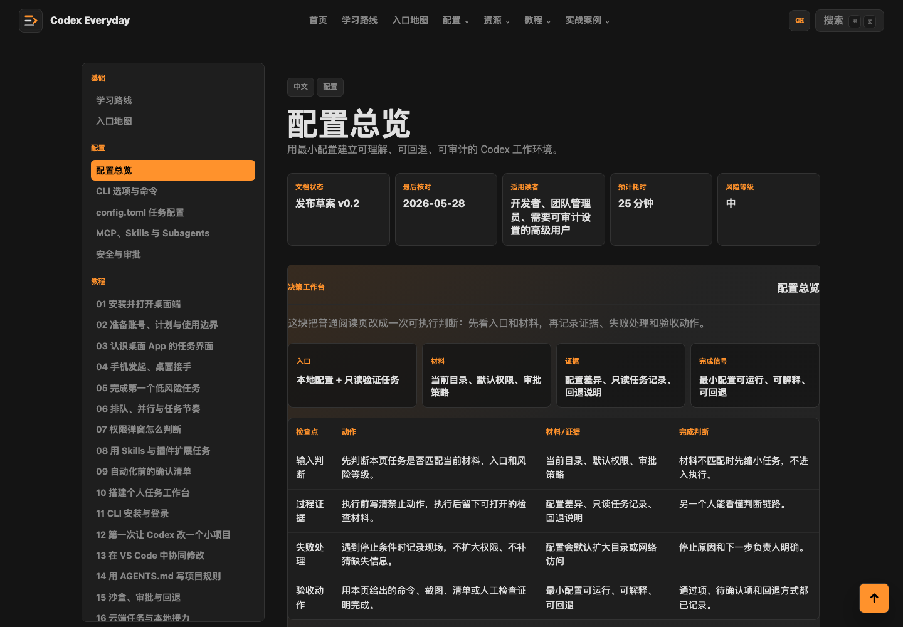

# Codex Everyday Guide

## 中文

Codex Everyday Guide 是一个面向真实工作流的深色产品风 Codex 双语知识站。

### 项目定位

本项目面向普通用户、创作者、个人开发者和小团队，目标是用清晰的任务边界、可复查的交付物和可重复的安全实践来使用 Codex。

### 文档标准

每个生成页面都遵循同一套专业结构：

- 适用范围与读者
- 前置条件
- 标准流程
- 交付物
- 风险控制
- 验收标准
- 先中文、后英文的完整分区内容

实战案例采用实测复盘写法，包含输入材料、运行环境、实测快照、操作剧本、命令回放、实测材料包、现场记录、执行转录、过程证据、交付预览、前后对比、质量评分、验收总账、结果样例、失败与修正、风险边界、人工交接、验收标准和可复用任务单。每个案例都会生成可打开的输入任务单、证据 CSV、结果片段、验收 runbook、执行转录、交付预览、前后对比、质量评分、操作回放、人工交接、现场图、验收总账、交付截图、原始现场片段、现场捕获、触发现场、修正现场、终审现场、关键交互片段、交互截图和证据看板，并汇总到案例库总账 JSON 与案例库健康报告 JSON。

### 本地构建

```bash
npm run build
npm run check
npm run verify
```

启动本地页面服务：

```bash
npm run serve
```

然后打开任一地址：

```text
http://127.0.0.1:4173/
http://127.0.0.1:4173/CodexGuide/
```

### 页面服务

仓库使用 GitHub Pages 发布静态站点。每次推送 `main` 后，GitHub Actions 会重新构建、检查并发布页面。

发布地址：

```text
https://edmund-xl.github.io/CodexGuide/
```

### 发布产物

构建会同步生成站点地图、爬虫规则、RSS、Atom、JSON Feed、Open Graph 分享图和页面结构化数据。`npm run check` 会检查这些发布产物是否存在，并确认每个 HTML 页面都有 canonical、分享卡片和 JSON-LD 元信息。

### 页面截图

首页展示深色产品界面、案例库状态面板、交付截图预览和主要入口。


案例总览展示按入口、证据、交付物、风险和成熟度拆分的实测任务矩阵，并提供案例库健康报告入口。


第一次任务教程展示实操验收面板、证据表、失败分支和可复用任务单。


配置总览展示决策工作台、入口判断、过程证据、失败处理和可复用判断单。



部署诊断案例的交付截图展示结果片段、证据状态、成熟度、终审动作和人工交接。


日志诊断案例的交付截图展示根因假设、验证状态、最小修复和人工交接。


远程服务健康检查案例的交付截图展示健康信号、修复建议、复测状态和回退判断。


使用规范页展示隐私、安全和人工复核要求。


### 项目结构

- `scripts/generate-site.mjs`: 双语静态站点生成器
- `scripts/verify-site.mjs`: 双语分区、链接、验收标准和禁用关键词质量检查
- `guide/`: 17 节结构化教程
- `configuration/`: 配置与安全专题
- `recipes/`: 14 个工具实测型实战案例
- `platform/`, `practice/`, `reference/`, `contribute/`: 入口地图、实践方法、官方文档和共建路线图
- `assets/`: SVG 图示、README 截图、案例材料包、案例库总账和案例库健康报告

### 使用规范

使用本项目时，请控制输入材料、保留复核步骤，并对高风险动作进行明确人工确认。

- 不要把密钥、客户资料、私人证件、完整合同或内部账号信息放入示例任务。
- 动态产品信息在发布前应回到 OpenAI 官方文档核对。
- 发布、删除、覆盖、发送和账号操作必须人工确认。

## English

Codex Everyday Guide is a dark product-style bilingual knowledge site for practical Codex workflows.

### Positioning

This project is designed for everyday users, creators, individual developers, and small teams who want to use Codex with clear task boundaries, reviewable outputs, and repeatable safety practices.

### Documentation Standard

Every generated page follows the same professional structure:

- Scope and audience
- Prerequisites
- Standard procedure
- Deliverables
- Risk controls
- Acceptance criteria
- Complete Chinese-first and English-second content sections

Recipes use a tool-tested retrospective format with input materials, run environment, run snapshot, operating script, command replay, lab artifact pack, run log, execution transcript, evidence trail, delivery preview, before/after table, quality scorecard, acceptance ledger, result sample, failures and corrections, risk boundaries, human handoff, acceptance criteria, and a reusable work order. Each recipe generates an openable input brief, evidence CSV, result sample, acceptance runbook, execution transcript, delivery preview, before/after file, quality scorecard, operation replay, human handoff, field snapshot, acceptance ledger, delivery capture, raw scene excerpt, run proof capture, trigger capture, correction capture, final review capture, key interaction excerpt, interaction capture, and evidence board, then rolls up into a recipe-library manifest JSON file and a recipe-library health report JSON file.

### Local Build

```bash
npm run build
npm run check
npm run verify
```

Start the local page service:

```bash
npm run serve
```

Then open either URL:

```text
http://127.0.0.1:4173/
http://127.0.0.1:4173/CodexGuide/
```

### Page Service

The repository publishes the static site with GitHub Pages. Every push to `main` triggers GitHub Actions to rebuild, check, and deploy the pages.

Published URL:

```text
https://edmund-xl.github.io/CodexGuide/
```

### Publishing Artifacts

The build generates a sitemap, robots file, RSS feed, Atom feed, JSON Feed, Open Graph preview image, and structured page metadata. `npm run check` verifies these artifacts and confirms that every HTML page includes canonical, social-card, and JSON-LD metadata.

### Screenshots

The home page shows the dark product interface, recipe-library status panel, delivery capture preview, and primary entry points.


The recipe index shows a tool-tested task matrix split by entry, evidence, deliverable, risk, and maturity, with a recipe-library health report entry.


The first-task guide shows the hands-on acceptance panel, evidence table, failure branch, and reusable work order.


The configuration overview shows the decision workbench, entry decision, process evidence, failure handling, and reusable decision brief.


The deployment diagnosis delivery capture shows result snippets, evidence status, maturity, final review, and human handoff.


The log diagnosis delivery capture shows root-cause hypotheses, validation status, minimal fix, and human handoff.


The remote service health delivery capture shows health signals, repair proposal, retest status, and rollback judgment.


The usage policy page shows privacy, safety, and human review requirements.


### Project Structure

- `scripts/generate-site.mjs`: bilingual static site generator
- `scripts/verify-site.mjs`: quality gate for separated bilingual sections, links, acceptance criteria, and forbidden keywords
- `guide/`: 17 structured guide chapters
- `configuration/`: configuration and security topics
- `recipes/`: 14 tool-tested practical recipes
- `platform/`, `practice/`, `reference/`, `contribute/`: entry map, operating model, official documentation, and contribution roadmap
- `assets/`: SVG diagrams, README screenshots, recipe artifact packs, recipe-library manifest, and recipe-library health report

### Usage Policy

Use this project with controlled materials, clear review steps, and explicit user approval for risky actions.

- Do not place secrets, customer records, private IDs, full contracts, or internal account data into example tasks.
- Dynamic product details should be checked against official OpenAI documentation before publication.
- Publishing, deleting, overwriting, sending, and account actions require human confirmation.
