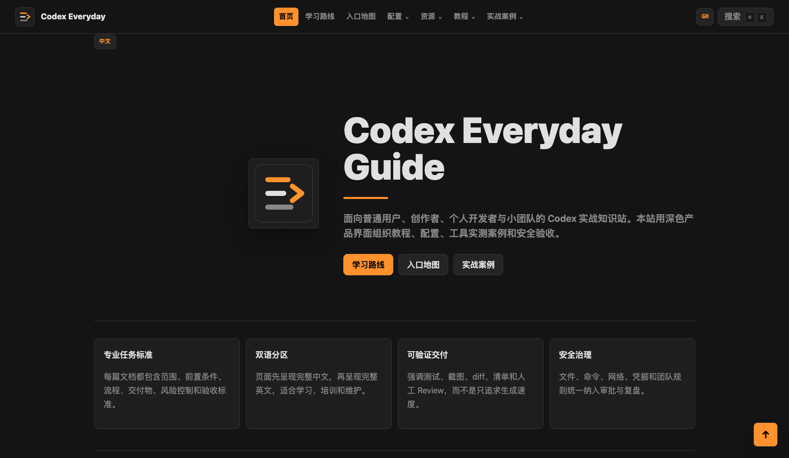
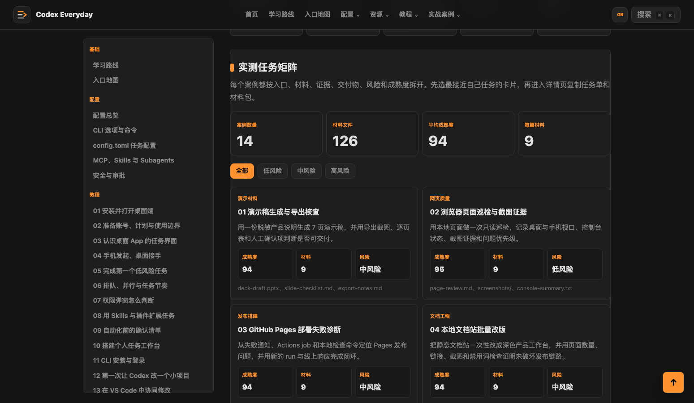
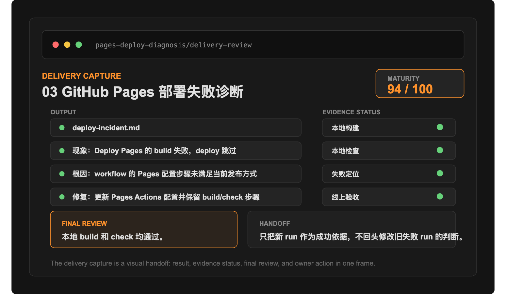
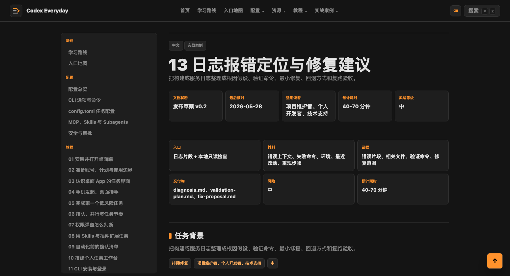
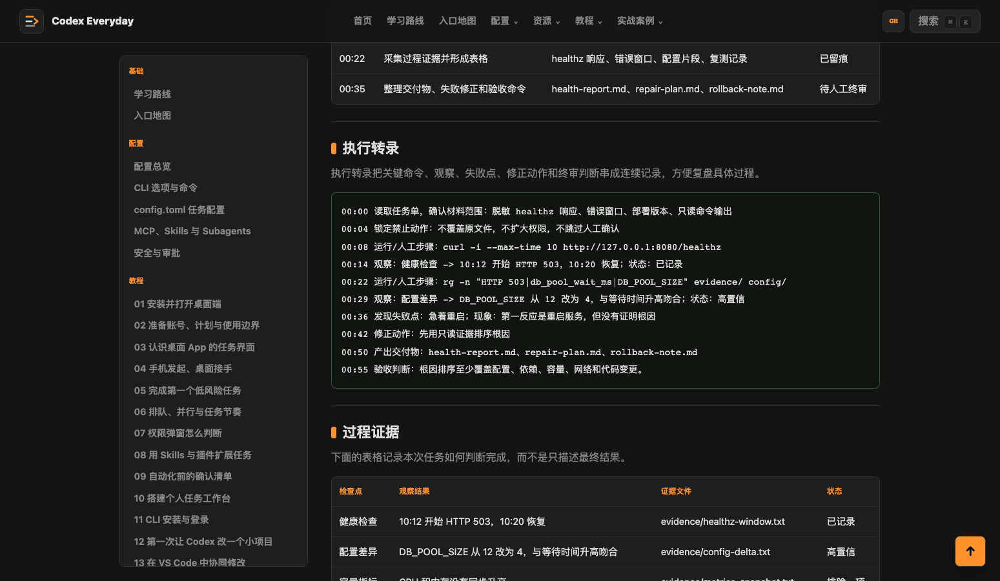
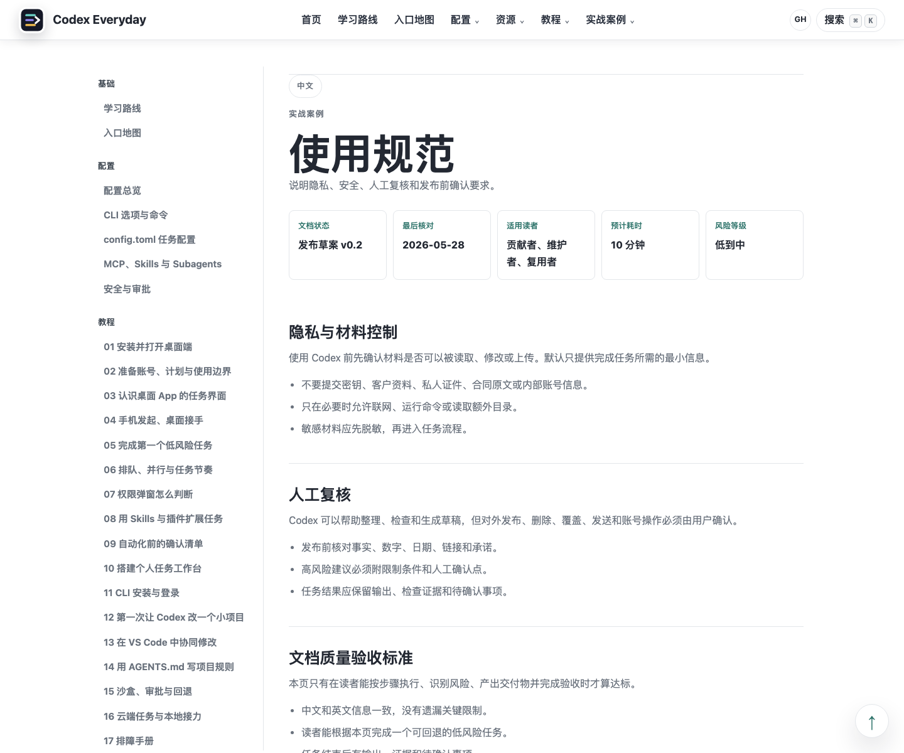

# Codex Everyday Guide

## 中文

Codex Everyday Guide 是一个面向真实工作流的深色产品风 Codex 双语知识站。

### 项目定位

本项目面向普通用户、创作者、个人开发者和小团队，目标是用清晰的任务边界、可复查的交付物和可重复的安全实践来使用 Codex。

### 文档标准

每个生成页面都遵循同一套专业结构：

- 适用范围与读者
- 前置条件
- 标准流程
- 交付物
- 风险控制
- 验收标准
- 先中文、后英文的完整分区内容

实战案例采用实测复盘写法，包含输入材料、运行环境、操作剧本、实测材料包、现场记录、执行转录、过程证据、交付预览、前后对比、质量评分、结果样例、失败与修正、风险边界、验收标准和可复用任务单。每个案例都会生成可打开的输入任务单、证据 CSV、结果片段、验收 runbook、执行转录、交付预览、前后对比、质量评分和证据看板，并汇总到案例库总账 JSON。

### 本地构建

```bash
npm run build
npm run check
npm run verify
```

启动本地页面服务：

```bash
npm run serve
```

然后打开任一地址：

```text
http://127.0.0.1:4173/
http://127.0.0.1:4173/CodexGuide/
```

### 页面服务

仓库使用 GitHub Pages 发布静态站点。每次推送 `main` 后，GitHub Actions 会重新构建、检查并发布页面。

发布地址：

```text
https://edmund-xl.github.io/CodexGuide/
```

### 页面截图

首页展示深色产品界面、中文优先内容结构和主要入口。



案例总览展示按入口、证据、交付物和风险拆分的实测任务矩阵。



部署诊断案例展示任务状态面板、实测材料包、证据表、验收命令和失败修正记录。



日志诊断案例展示根因假设、验证命令、最小修复和回退方式。



远程服务健康检查案例展示执行转录、根因排序、修复建议和复测清单。



使用规范页展示隐私、安全和人工复核要求。



### 项目结构

- `scripts/generate-site.mjs`: 双语静态站点生成器
- `scripts/verify-site.mjs`: 双语分区、链接、验收标准和禁用关键词质量检查
- `guide/`: 17 节结构化教程
- `configuration/`: 配置与安全专题
- `recipes/`: 14 个工具实测型实战案例
- `platform/`, `practice/`, `reference/`, `contribute/`: 入口地图、实践方法、官方文档和共建路线图
- `assets/`: SVG 图示、README 截图和案例材料包

### 使用规范

使用本项目时，请控制输入材料、保留复核步骤，并对高风险动作进行明确人工确认。

- 不要把密钥、客户资料、私人证件、完整合同或内部账号信息放入示例任务。
- 动态产品信息在发布前应回到 OpenAI 官方文档核对。
- 发布、删除、覆盖、发送和账号操作必须人工确认。

## English

Codex Everyday Guide is a dark product-style bilingual knowledge site for practical Codex workflows.

### Positioning

This project is designed for everyday users, creators, individual developers, and small teams who want to use Codex with clear task boundaries, reviewable outputs, and repeatable safety practices.

### Documentation Standard

Every generated page follows the same professional structure:

- Scope and audience
- Prerequisites
- Standard procedure
- Deliverables
- Risk controls
- Acceptance criteria
- Complete Chinese-first and English-second content sections

Recipes use a tool-tested retrospective format with input materials, run environment, operating script, lab artifact pack, run log, execution transcript, evidence trail, delivery preview, before/after table, quality scorecard, result sample, failures and corrections, risk boundaries, acceptance criteria, and a reusable work order. Each recipe generates an openable input brief, evidence CSV, result sample, acceptance runbook, execution transcript, delivery preview, before/after file, quality scorecard, and evidence board, then rolls up into a recipe-library manifest JSON file.

### Local Build

```bash
npm run build
npm run check
npm run verify
```

Start the local page service:

```bash
npm run serve
```

Then open either URL:

```text
http://127.0.0.1:4173/
http://127.0.0.1:4173/CodexGuide/
```

### Page Service

The repository publishes the static site with GitHub Pages. Every push to `main` triggers GitHub Actions to rebuild, check, and deploy the pages.

Published URL:

```text
https://edmund-xl.github.io/CodexGuide/
```

### Screenshots

The home page shows the dark product interface, Chinese-first content structure, and primary entry points.


The recipe index shows a tool-tested task matrix split by entry, evidence, deliverable, and risk.


The deployment diagnosis recipe shows the task status panel, lab artifact pack, evidence table, acceptance commands, and correction record.


The log diagnosis recipe shows root-cause hypotheses, validation commands, minimal fix, and rollback method.


The remote service health recipe shows the execution transcript, root-cause ranking, fix proposal, and retest checklist.


The usage policy page shows privacy, safety, and human review requirements.


### Project Structure

- `scripts/generate-site.mjs`: bilingual static site generator
- `scripts/verify-site.mjs`: quality gate for separated bilingual sections, links, acceptance criteria, and forbidden keywords
- `guide/`: 17 structured guide chapters
- `configuration/`: configuration and security topics
- `recipes/`: 14 tool-tested practical recipes
- `platform/`, `practice/`, `reference/`, `contribute/`: entry map, operating model, official documentation, and contribution roadmap
- `assets/`: SVG diagrams, README screenshots, and recipe artifact packs

### Usage Policy

Use this project with controlled materials, clear review steps, and explicit user approval for risky actions.

- Do not place secrets, customer records, private IDs, full contracts, or internal account data into example tasks.
- Dynamic product details should be checked against official OpenAI documentation before publication.
- Publishing, deleting, overwriting, sending, and account actions require human confirmation.
